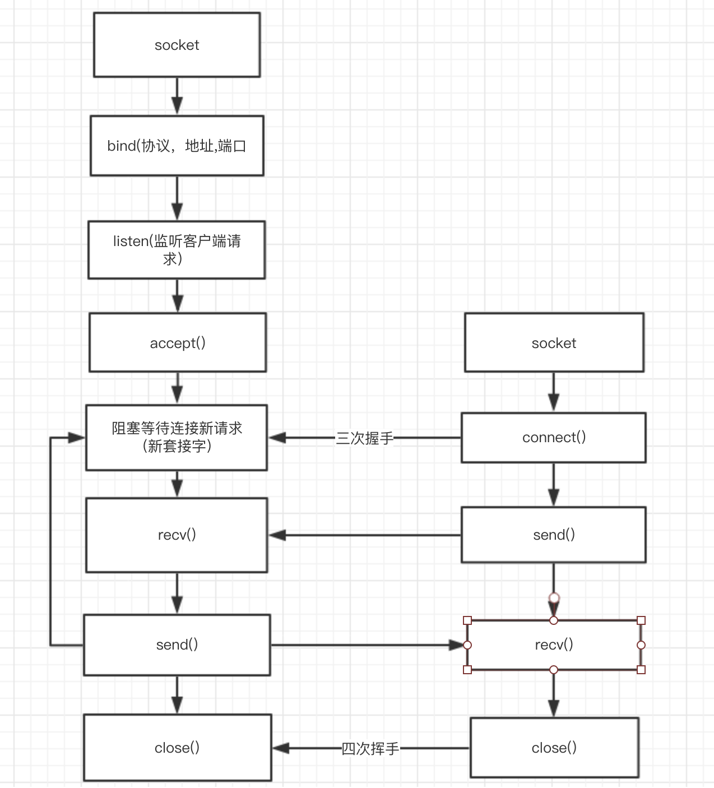

## socket的使用

> socket.socket(网络层ip协议蔟,传输层协议类型,默认协议)

```py
# server.py

# 导入模块
import socket

# 实例化服务器,使用ipv4协议,tcp协议
s = socket.socket(socket.AF_INET,socket.SOCK_STREAM)

# 绑定端口号 0.0.0.0监听所有ip地址
s.bind(('0.0.0.0',12345)) 

# 监听端口,设置连接数 
s.listen(5)

# 阻塞挂起，等待客户端连接
connSocket,addr = s.accept()

# 连接成功后，接收客户端发来的数据,设置一次接收的数据大小,1kb
data = connSocket.recv(1024)

# 返回数据
connSocket.send(data)

# 断开连接
connSocket.close()

# client.py

# 导入模块
import socket

# 实例化客户端
client = socket.socket(socket.AF_INET,socket.SOCK_STREAM)

# 连接服务器
client.connect(('127.0.0.1',8080))

# 接收服务器数据
client.recv(1024)

# 断开连接
client.close()
```

## socket的通信过程




